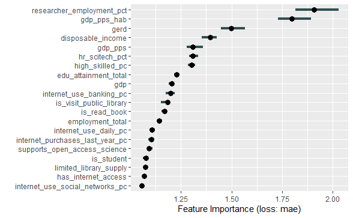
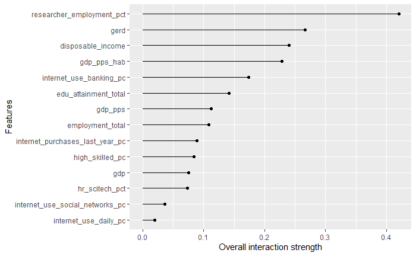
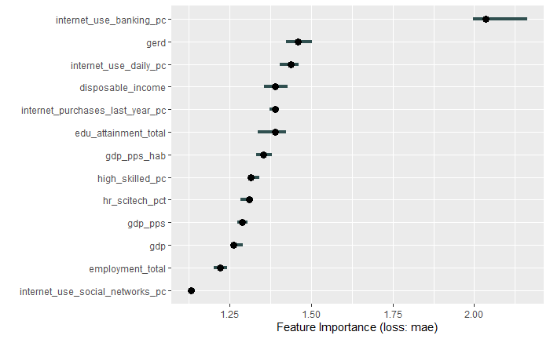
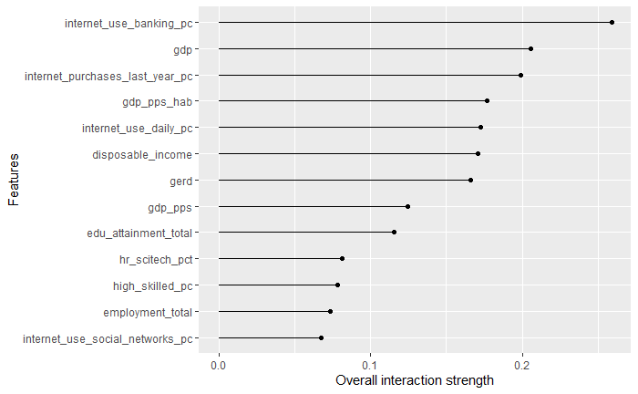

```{r setup, include=FALSE, echo=FALSE}
knitr::opts_chunk$set(echo = TRUE)
library(tidyverse) # includes dplyr, tidyr and ggplot2
library(sf)        # for the map plotting
library(colorRamps)# map coloring
#code to visualize data on the map
#devtools::install_github("antaldaniel/satellitereport")
#satellitereport::create_choropleth()
library(satellitereport)

require(caret); require(randomForest); # for random forest
require(iml)  # for interpretable random forest results 

library(sjPlot); library(sjmisc)  # interaction in regression
library(MASS)
library(jtools)
library(huxtable)
library (car)


# data is compiled elsewhere. 
#uncomment the next line if you want to rerun data prepararion
#source("helper_code/prepare_data.R")
load(file.path("data", "all_data_for_analysis.rda"))
```

# Introduction

The following document contains the analyisis of illegal library downloads on an European NUTS2 regional level. We used EUROSTAT and EUROBAROMETER data sources to compile a dataset with 265 NUTS2 regions, 7 versions of the explained variable, 17 explanatory variables, and one metadata variable (the regional code.) We describe the  dataset used in the  analysis in a separate document in this repository. 
The map below indicates all European regions with where the cases are complete for all variables.

# Analysis

## Descriptives, and general concerns

The median number of downloads is 10k, the mean is higher, 18648. With some extreme outliers.

```{r count descriptives}
summary(eurostat_complete_data$count)
histogram(log10(eurostat_complete_data$count), 
          nint=100, 
          type="count")
boxplot(eurostat_complete_data$count)
```

Some of the otlier regions are as expected, big, metropolitan regions, such as inner London, with large population s, and a strong concentration of knowledge-intensive activities. There are, however, exceptions to this rule, where regions without significant urban centers, or eductional, research capacities demonstrate unusually high download volumes. We identified a number of possible reasons for these anomalies:

* there might be issues with the translation of IP addresses to Geoocation. We used the Maxmind service to assign coordinates to IP addresses, and that service may vary in terms of resultion within different european countries, and the ability to correctly assign location fir different internet servioce providers. In this latter case it is possible that lacking better information, whole IP ranges resolve to, for example, the HQ address of the provider, rather than the approximate location of the user. This is a well-known issue in general, and a potential source of noise in our case as well.

* We did our best to identify Virtual Private Networks, TOR exit nodes, and other traffic sorurces which may mask the true location of the downloader. Such information may not always be available, therefore it is possible that we failed to identify traffic sources as VPNs and thus the volume of traffic asociated with a particular IP address belongs to an unknown number of users from other locations.

* Last, but not least, though we tried our best to identify bots and other automated downloads in the dataset (by, for example, filterimg repeated downloads from the same Ip of the same book within a given time-window), we did not identified the automatic scraping of parts of the shadow library. In other parts of the dataset we have evidence for such autoated, scraper geerated traffic, but on smaller scale this might also produce unexpected outliers in the European dataset.

```{r completemap, echo=FALSE}
eurostat_complete_data %>%
  dplyr::mutate ( time = 2013 ) %>%
  dplyr::select ( geo, count, time ) %>%
  dplyr::rename ( values = count ) %>%
  satellitereport::create_choropleth(., level = 2, n = 7, 
                                     style = 'pretty', 
                                     na_color = 'blue',
                                     color_palette= colorRamps::green2red(7))
```

That being said, if we look at the degrees of correlation between or ultimate dependent variable, the number of downloads in a region, and other variables, we see strong correlations, especially with wealth (measured by GDP), the number of researchers, population, and knowledge intensive economic activities.
```{r correlation, echo=FALSE }
correlations <- eurostat_complete_data %>%
  dplyr::select( -starts_with("count_")) %>%
  dplyr::select ( -geo ) %>% 
  as.matrix() %>%
  cor() 

correlations [, "count"]  %>% 
  as.data.frame() %>%
  rownames_to_column() %>%
  purrr::set_names ( ., c("variable", "cor")) %>%
  dplyr::filter ( ! grepl( "count", variable )) %>% 
  dplyr::mutate ( variable = forcats::fct_reorder(variable, -cor )) %>%
  ggplot (., aes ( x = variable, 
                   y = cor, 
                   fill = cor )) +
  geom_col(  ) +
  scale_fill_gradient2( high = "#007CBB", 
                        mid = 'white', 
                        low = "#DB001C", 
                        midpoint = 0) +
  labs ( title = "Correlation with Count Data", 
         fill = 'Correlation', y = "", x = "") +
  theme (
    axis.text.x = element_text (angle = 30, hjust = 1, size = rel(0.85))
  )
```

## Spatial auto-correlation 

So far, we have not considered the spatial distribution of the data, only the correlation of various data levels among territorial units. If the spatial geography of the environment is relevant to the data, then apart from correlation, we should see a level autocorrelation by nearer territorial units. We have examined the spatial autocorrelation using the `spdep` package of Bivand, Pebesma and Gomez-Rubio [@spdep2013].

```{r mcmoran, echo=FALSE, eval=TRUE}
#we use the full download dataset, rather than the one complete with EUROSTAT data, so we can include all European NUTS2 regions for his abalysis 
download_data <- readRDS( file.path("data-raw","downloads_nuts_2016.rds")) 

moran_analysis_spdf <-  geodata@data %>%
  dplyr::left_join (.,  
  download_data %>%
     dplyr::select ( id, count ) %>%
     dplyr::mutate ( count = ifelse (is.na(count), 0, count)),
  by = 'id' )

moran_i_spdf <-  geodata@data %>%
  dplyr::left_join (.,  
  download_data %>%
     dplyr::select ( id, count ),  by = 'id' ) %>%
     dplyr::filter  ( !is.na(count )) 


moran_analysis_spdf_gdp_pps <-  geodata@data %>%
  dplyr::left_join (.,  
             eurostat_data %>%
               dplyr::select ( geo, gdp_pps ) %>%
               dplyr::mutate ( id = geo),
             by = 'id' ) %>%
     dplyr::filter  ( !is.na(gdp_pps)) 


#summary ( moran_i_spdf$count )
#summary ( moran_analysis_spdf_gdp_pps$gdp_pps )

geodata_full   <- geodata [which ( moran_i_spdf$id %in% geodata@data$id), ]
geodata_gdp_full <- geodata [which ( moran_analysis_spdf_gdp_pps$id %in% geodata@data$id), ]

w <- spdep::poly2nb(geodata_full, row.names=geodata_full$id )
w_gdp <- spdep::poly2nb(geodata_gdp_full, row.names=geodata_gdp_full$id )
#neighbor lists
ww <- spdep::nb2listw(w, style='B', zero.policy=TRUE)
ww2 <- spdep::nb2listw(w_gdp, style='B', zero.policy=TRUE)


set.seed(2019)
moran_count_results <- spdep::moran.mc(
                x = moran_i_spdf %>%
                  dplyr::select ( count ) %>% 
                  unlist () %>%
                  as.numeric(),       
                ww, 
                nsim=999,
                zero.policy = TRUE)

set.seed(2019)

moran_gdp_results <- spdep::moran.mc(
               x = moran_analysis_spdf_gdp_pps %>%
                  dplyr::select ( gdp_pps ) %>% 
                  unlist () %>%
                  as.numeric(),       
                ww2, 
                nsim=999,
                zero.policy = TRUE)

```


Moran's I statistic takes the value of 0.042 with a p-value of 0.094, so we can only reject the randomness of downloads at a 90% significance level. The positive z value means that the downloads are clustering, i.e. NUTS2 regions with high download numbers tend to be neighbors of NUTS2 regions with high download numbers.  


```{r moran_count, echo=FALSE}
moran_count_results
```

Similarly, running the same test for GDP adjusted by purchasing power standard, we see a very similar level of spatial autocorrelation.

```{r moran_gdp, echo=FALSE}
moran_gdp_results
```


# Interaction with environmental variables

Next, we created a two-step modelling where we first explored the basic geographical and demographical forces at play, and then we turned our attention to social, cultural and economic variables. We normalized the variables in two steps to make them comparable for modelling.  We created variables that are related to the number of populations, number of researcher population or the size of the NUTS2 regional area.  In the next step we scaled the variables to unit variance, so that they have equal weight in the variable selection process.

We took a first look at this data with two methods. First, we created all possible linear regression equations and two-variable multiple linear regression between the count data and the socio-economic variables. We also used the random forest algorithm to rank the importance of socio-economic environmental variables in explaining the difference in the level of book piracy. The logic of the two approaches is similar. We use a well-defined searching algorithm to find a relationship between the levels of socio-economic environmental variables and download count numbers.

### Linear regression models

To understand the interaction of environmental variables and count data, we created all possible linear regressions 'explaining' the variability of count data in the following steps:

- We created the initial linear regression
- We checked for outliers, and removed them
- Re-run the regression model, and selected those whose coefficients were significant on 1.96 level
- We ordered the remaining 38 models by adjusted R squares.

```{r linregsummary, out.width='90%', message=FALSE, echo=FALSE}
# To re-run the many models with the same dataset as used here.
#uncomment the next line if you want to rerun the lingreg models
#source ( 'helper_code/all_linreg_model_combinations.R')
count_coefficients <- readRDS(
  file.path('data-raw','all_linreg_coefficients_count.rds') )

#display coefficients
count_coefficients %>%
  dplyr::select ( names, values, adj.r.squared ) %>%
  mutate ( names = gsub("_", " ", names )) %>%
  ggplot ( ., aes ( x = adj.r.squared, 
                    y = values, 
                    alpha = adj.r.squared)) +
  geom_point() +
  geom_hline (yintercept = 0, linetype = 'dashed') +
  #scale_y_continuous( limits = c(-0.2, 0.2)) +
  facet_wrap ( facets = "names", ncol = 4) +
  labs ( y = 'coefficient values',
         x = "adjusted R-squared", 
         title = "Strength & Consistency of Coefficients", 
         subtitle = "Multiple regressions on count, based on scaled variables, and no outliers") +
  theme ( legend.position = 'bottom')
```

The download count is related to the area of the region and the population, which is a trivial finding. If we normalize the count data with the area, we find less trivial models.  We collected only simple, linear, multiple regressions models with two significant coefficients (at t>1.96 level).


```{r linregsummary2, out.width='90%', message=FALSE, echo=FALSE}
# To re-run the many models with the same dataset as used here.
#uncomment the next line if you want to rerun the lingreg models
#source ( 'helper_code/all_linreg_model_combinations.R')
count_per_area_coefficients <- readRDS(
  file.path('data-raw','all_linreg_coefficients_count_per_area.rds') )

#display coefficients
count_per_area_coefficients %>%
  dplyr::select ( names, values, adj.r.squared ) %>%
  mutate ( names = gsub("_", " ", names )) %>%
  ggplot ( ., aes ( x = adj.r.squared, 
                    y = values, 
                    alpha = adj.r.squared)) +
  geom_point() +
  geom_hline (yintercept = 0, linetype = 'dashed') +
  facet_wrap ( facets = "names", ncol = 4) +
  labs ( y = 'coefficient values',
         x = "adjusted R-squared", 
         title = "Strength & Consistency of Coefficients", 
         subtitle = "Multiple regressions on count_per_area, based on scaled variables, and no outliers") +
  theme ( legend.position = 'bottom')
```

The coefficients are relatively consistent, with the exception of the level of daily interet users in the area.  The most important variables are the level of GDP, number of researchers in the area and R&D spending (GERD).

## Random forest models

In the folloowing I created three sets of analysis: one that uses count per researcher as the dependent variable, One that uses downoad per capita as download veriable, and one that uses raw count as a dependent variable.
The reason for that is that if i use dl/researcher variable as dependent, I may not be able to capture and explain the downloads that possibly come from non-researchers, while if I use dl/capita, then i may find independent variables that account for the probessional (researcher downloads) and others that are moe charctristic for no-professionals.

## count per capita

```{r var_select, eval=TRUE, message=FALSE, echo=FALSE}
#count per capita
cpc_var_select_df <- eurostat_complete_scaled %>% 
  dplyr::select ( -researchers_total, 
                  -population_total,
                  -count_per_million,
                  -count_per_thousand_researchers,
                  -one_of(c("area_land_filled", "count", 
                            "count_per_area", 
                            "count_per_researcher",
                            "count_per_pop_density"))) 


## Tuning this model
set.seed(2019) # for reproducability, the random number seed 2019 is used.
cpc_best_mtry_var_select <- tuneRF(dplyr::select ( cpc_var_select_df, 
                                     -geo,
                                     -count_per_capita),
                   as.vector(cpc_var_select_df$count_per_capita), 
                   mtyStart = 1, 
                   stepFactor=1,
                   improve=1e-5, ntree=500, 
                   plot = FALSE, trace = FALSE) #do not plot results...
cpc_var_select.rf <- randomForest(count_per_capita ~ . ,
                            dplyr::select ( cpc_var_select_df, 
                                     -geo ),
                            mtry = as.numeric(cpc_best_mtry_var_select[1]),
                            ntree=5000 )
```

``` {r randomforest_results, echo=FALSE}
cpc_var_select.rf$importance  %>%
  as.data.frame() %>%
  rownames_to_column(., var = "variable") %>%
  set_names ( ., c("variable", "IncNodePurity")) %>%
  arrange ( -IncNodePurity)
```

Edu attainment, disposable income may be relevant for the whole population, beyond just researchers.

```{r feature_importance, out.width='90%', out.width='90%', eval=FALSE}

#count per capita
cpc_predictor_var_select = Predictor$new(
  cpc_var_select.rf,
  data = dplyr::select ( cpc_var_select_df , -geo, - count_per_capita),
  y = as.numeric(cpc_var_select_df$count_per_capita))

cpc_imp <- FeatureImp$new(cpc_predictor_var_select, loss = "mae", n.repetitions = 10)
plot(cpc_imp)
```

```{r display cpc importance plot, echo=FALSE}

```


```{r percapita_interaction, out.width='90%', eval=TRUE}
#This code takes several minutes to run if uncommented.
run_in_function <- function() {
  interact <- Interaction$new(predictor_var_select)
  plot(interact) #causes knitr issues, something is wrong with the plot, maybe the size, I saved it and print int from file.

}
#run_in_function()
#I saved the result here:

```

### count per capita Best model


```{r percapita_bestmodel,  out.width='90%', eval=TRUE, echo=FALSE}
# for reproducability, the random number seed 2019 is used.
set.seed(2019)

cpc_best_df <- eurostat_complete_scaled %>% 
  dplyr::select (count_per_capita, 
                 gdp_pps_hab, 
                 researcher_employment_pct,
                 disposable_income,
                 edu_attainment_total, 
                 hr_scitech_pct,
                 internet_use_banking_pc)

#A simple random forest 
cpc_best.rf <-  randomForest(count_per_capita ~ . ,
                            cpc_best_df,
                            mtry = 5,
                            ntree= 5000 )

cpc_best_predictor = Predictor$new(
  cpc_best.rf,
  data = cpc_best_df ,
  y = "count_per_capita")

cpc_imp_best <- FeatureImp$new(cpc_best_predictor, loss = "mae")

plot(cpc_imp_best)

cpc_best.rf$importance  %>% 
  as.data.frame() %>%
  arrange ( -IncNodePurity)
```


### Linear Regressions


```{r percapita_scatterplot, echo=FALSE}
#first lets see how in the best model data anbd correlations look like

panel.cor <- function(x, y, digits = 2, prefix = "", cex.cor, ...)
{
    usr <- par("usr"); on.exit(par(usr))
    par(usr = c(0, 1, 0, 1))
    r <- cor(x, y)
    txt <- format(c(r, 0.123456789), digits = digits)[1]
    txt <- paste0(prefix, txt)
    if(missing(cex.cor)) cex.cor <- 0.8/strwidth(txt)
    text(0.5, 0.5, txt)
}

cpc_correlations_bestmodel <- eurostat_complete_data %>%
  dplyr::select (count_per_capita, 
                 gdp_pps_hab, 
                 researcher_employment_pct,
                 disposable_income,
                 edu_attainment_total,
                 hr_scitech_pct,
                 internet_use_banking_pc) %>%
      dplyr::mutate_if( is.numeric, as.numeric)%>%
  as.matrix() %>%
  pairs(lower.panel = panel.smooth,
        upper.panel = panel.cor,
      gap=0, 
      row1attop=FALSE, 
      main="Correlation coefficients on the upper panels, scatter plots in the lower panels with LOESS smooths")


```

To be able to use poisson and quasipoisson models I use a count per million variable, which is the rounded value of cpunt per million inhabitants.

I test models with and without the scitechemployment percentage, and found that that variable comes with horrible multicillinearity. so i decided to drop it. I also switched  gdp_pps_hab to GDP_pps because though it had the most importance, it  also suffered from multicollinearity.

``` {r percapita_linear models, echo=TRUE, out.width='90%'}

#poisson with scitech hr
percapita_plm2 <- glm (count_per_million ~ gdp_pps_hab +
                 researcher_employment_pct +
                 disposable_income +
                 edu_attainment_total +
                 hr_scitech_pct +  
                 internet_use_banking_pc, 
                 data = eurostat_complete_data, 
                 family = poisson )


#poisson withoutr scitech hr
percapita_plm1 <- glm (count_per_million ~ gdp_pps_hab +  researcher_employment_pct +
                 disposable_income +
                 edu_attainment_total +
                 internet_use_banking_pc, 
                 data = eurostat_complete_data, 
                 family = poisson )

#Switch to gdp pps

percapita_plm3 <- glm (count_per_million ~ log(gdp_pps) +  researcher_employment_pct +
                 disposable_income +
                 edu_attainment_total +
                 internet_use_banking_pc,
                 data = eurostat_complete_data, 
                 family = poisson )

#qpoisson
percapita_qplm3 <- glm (count_per_million ~ log(gdp_pps) +  researcher_employment_pct +
                 internet_purchases_last_year_pc,
                 data = eurostat_complete_data, 
                 family = quasipoisson)

percapita_qplm4 <- glm (count_per_million ~ 
                          log(gdp_pps) +
                          researcher_employment_pct +
                          internet_use_banking_pc,
                        data = eurostat_complete_data,
                        family = quasipoisson)

percapita_qplm5 <- glm (count_per_million ~ log(gdp_pps) +
                          researcher_employment_pct +
                          internet_purchases_last_year_pc +
                          log(disposable_income) +
                          edu_attainment_total, data =
                          eurostat_complete_data, 
                        family = quasipoisson)

vif(percapita_qplm3)

#summary(percapita_plm3)
#summary(percapita_qplm3)

export_summs(percapita_qplm4, percapita_qplm3, percapita_qplm5, 
             digits=3, 
             statistics = c("null.deviance", "deviance")
             )

#summary (percapita_qplm4, percapita_qplm3)  ### ERROR
#vif() ### ERROR
```

The  model offers the following  findings:

- gdp is has a significant positive effect in te poisson regression, but has not in the qpoisson model. 

- the per capita dowloads grow with the a higher percentage of researchers in the labor pool, and with higher disposable income. These point to a structural demand effect (economic/ research activity drives demand for scientific literature), and and individual demand effect:  higher disposable income does not lower piracy, but actually creates more demand.

- on the other hand, per capita downloads are moderated by better online skills. The negative effect of online banking use may point to a higher use of legal sources, such as online and offline purchases, butwe should also consider that online proficency provides the skills to hide the online traces of illegal activities via the use of VPNs and Tor brosing.

DANI: vajon miert nem szignifikans a GDP? hova lesz az a hatas?

```{r percapita_predicted_vs_actual, echo=FALSE}
plot_model(percapita_qplm3,
           type = "pred")

plot(percapita_qplm3)
correlation::correlation(eurostat_complete_data)
```

# Count per researcher

Here we model the per researcher download counts as dependent variables.

```{r perresearcer_var_select_results, eval=TRUE, echo=FALSE}
#random forest count per researcher  

cpr_var_select_df <- eurostat_complete_scaled %>% 
  dplyr::select ( -researchers_total, 
                  -population_total,
                  -count_per_million,
                  -count_per_capita,
                  -count_per_thousand_researchers,
                  -researcher_employment_pct,
                  -one_of(c("area_land_filled", "count", 
                            "count_per_area", 
                            "count_per_pop_density"))) 


cpr_var_select.rf <- randomForest(count_per_researcher ~ . ,
                            dplyr::select ( cpr_var_select_df, 
                                     -geo ),
                            mtry = as.numeric(cpc_best_mtry_var_select[1]),
                            ntree=5000 )

cpr_var_select.rf$importance  %>%
  as.data.frame() %>%
  #rownames_to_column(., var = "variable") %>%
  #set_names ( ., c("variable", "IncNodePurity")) %>%
  arrange ( -IncNodePurity)
```


```{r perresearcher_var_select_results, eval=FALSE, echo=FALSE}
#count per researcher 
cpr_var_select.rf <- randomForest(count_per_researcher ~ . ,
                            dplyr::select ( cpr_var_select_df, 
                                     -geo ),
                            mtry = as.numeric(cpc_best_mtry_var_select[1]),
                            ntree=5000 )

cpr_var_select.rf$importance  %>% as.data.frame() %>%
  #rownames_to_column(., var = "variable") %>%
  #set_names ( ., c("variable", "IncNodePurity")) %>%
  arrange ( -IncNodePurity)


cpr_predictor_var_select = Predictor$new(
  cpr_var_select.rf,
  data = dplyr::select ( cpr_var_select_df , -geo, 
                         -count_per_researcher ),
  y = as.numeric(cpr_var_select_df$count_per_researcher))

cpr_imp <- FeatureImp$new(cpr_predictor_var_select,
                      loss = "mae",
                      n.repetitions = 10)

plot(cpr_imp)
```

```{r display perresearcher_rf_plot, echo=FALSE}

```

```{r perresearcher_interaction,out.width='90%', eval=TRUE, echo=FALSE}
#This code takes several minutes to run if uncommented.
#cpr_interact <- Interaction$new(cpr_predictor_var_select)
#plot(cpr_interact) #causes knitr issues, something is wrong with the plot, maybe the size, I saved it and print int from file.

#I saved the result here:

```


```{r bestmodel, out.width='90%', eval=TRUE, echo=FALSE}
# for reproducability, the random number seed 2019 is used.
set.seed(2019)

cpr_best_df <- eurostat_complete_scaled %>% 
  dplyr::select (count_per_researcher, 
                 internet_use_banking_pc,
                 disposable_income,
                 edu_attainment_total,
                 gdp_pps_hab, 
                 gerd)

#A simple random forest 
cpr_best.rf <-  randomForest(count_per_researcher ~ . ,
                            cpr_best_df,
                            mtry = 5,
                            ntree=5000 )

cpr_best_predictor = Predictor$new(
  cpr_best.rf,
  data = cpr_best_df ,
  y = "count_per_researcher")

cpr_imp_best <- FeatureImp$new(cpr_best_predictor, loss = "mae")

```

```{r display perresearcher_best models, echo=FALSE }
plot(cpr_imp_best)

cpr_best.rf$importance  %>% as.data.frame() %>%
  arrange ( -IncNodePurity)

```


### Linear Regressions

As before I created a download per thousand researchers variable, which I rounded, so it could be run on Poisson models.


```{r perresearcher correlations, echo=FALSE}
#first lets see how in the best model data anbd correlations look like

cpr_panel.cor <- function(x, y, digits = 2, prefix = "", cex.cor, ...)
{
    usr <- par("usr"); on.exit(par(usr))
    par(usr = c(0, 1, 0, 1))
    r <- cor(x, y)
    txt <- format(c(r, 0.123456789), digits = digits)[1]
    txt <- paste0(prefix, txt)
    if(missing(cex.cor)) cex.cor <- 0.8/strwidth(txt)
    text(0.5, 0.5, txt)
}

cpr_correlations_bestmodel <- eurostat_complete_data %>%
  dplyr::select (count_per_researcher, 
                 internet_use_banking_pc,
                 disposable_income,
                 edu_attainment_total,
                 gdp_pps_hab, 
                 gerd) %>%
  as.matrix() %>%
  pairs( lower.panel = panel.smooth,
        upper.panel = panel.cor,
      gap=0, row1attop=FALSE, 
      main="Correlation coefficients on the upper panels, scatter plots in the lower panels with LOESS smooths")


```

I also tested models, with and without scitech workforce because of high milticollinearity. here interestingly the gdp_pps_hab did not raise multicollinearity issues

``` {r perresearcher linear models, out.width='90%'}
#with scitech
perresearcher_plm2 <- glm (count_per_thousand_researchers ~
                             gdp_pps_hab  +
                             disposable_income +
                             edu_attainment_total + gerd +
                             internet_use_banking_pc+hr_scitech_pct,
                           data = eurostat_complete_data, 
                           family = poisson )

#without
perresearcher_plm1 <- glm (count_per_thousand_researchers ~
                             gdp_pps  +
                             disposable_income +
                             edu_attainment_total + gerd +
                             internet_use_banking_pc,
                           data = eurostat_complete_data, 
                           family = poisson )

#qpoisson model
perresearcher_qplm1 <- glm (count_per_thousand_researchers ~ 
                              gdp_pps  + disposable_income + 
                              edu_attainment_total + gerd +
                              internet_use_banking_pc,
                            data = eurostat_complete_data, 
                            family = quasipoisson )

vif(perresearcher_qplm1)
summary(perresearcher_qplm1)

```

since the VIF check points to a high multicolleinearity with hr_scitech_pct, we remove that variable from the analysis.
Since the poisson models shows high overdispersion, we run a quasipoisson model. there the effects of the GDP and disposable income become non-significant. 

These results point to similar conclusions. the the per researcher download volume:

- is independent of the gdp  but are affected by
- the R&D expenditure, internet profieiency and the higher education attainment.

Regions with more  internet savvy populations, and with higher R&D spending and higher disposable income download less per researcher.

```{r plot perresearcher models}
plot_model(perresearcher_qplm1, type = "pred")
```

# Count Regression Models

``` {r count models, out.width='90%'}

#count without R&D
count_plm2 <- glm (count ~ gdp_pps +  researcher_employment_pct +
                 disposable_income +
                 edu_attainment_total +
                 internet_use_banking_pc, 
                 data = eurostat_complete_data, poisson )

#with R&D
count_plm3 <- glm (count ~ gdp_pps +  researcher_employment_pct +
                 disposable_income +
                 edu_attainment_total +
                 internet_use_banking_pc +
                  gerd
                , data = eurostat_complete_data, poisson )

count_plm4 <- glm (count ~ gdp_pps +  
                    researcher_employment_pct +
                    disposable_income +
                    edu_attainment_total +
                    internet_use_banking_pc +
                    gerd+
                    internet_purchases_last_year_pc
                    , data = eurostat_complete_data, poisson )

vif(count_plm4)
summary (count_plm4)
summary (count_plm3)

#qpoisson
count_qplm2 <- glm (count ~ gdp_pps +  researcher_employment_pct +
                 disposable_income +
                 edu_attainment_total +
                 internet_use_banking_pc,
                 data = eurostat_complete_data, quasipoisson)

count_qplm3<- glm (count ~ gdp_pps +  researcher_employment_pct +
                 disposable_income +
                 edu_attainment_total +
                 internet_use_banking_pc +
                gerd,
                data = eurostat_complete_data, quasipoisson )
count_qplm4 <- glm (count ~ gdp_pps +  
                    researcher_employment_pct +
                    disposable_income +
                    edu_attainment_total +
                    internet_use_banking_pc +
                    gerd +
                    internet_purchases_last_year_pc,
                    data = eurostat_complete_data, quasipoisson )

export_summs(count_qplm2,count_qplm3,count_qplm4, digits=10, statistics = "all")

```

```{r plot best count model, echo=FALSE}
plot_model(count_qplm2, type = "pred")
```

in the total count model multicollinearity forces us to use GDP_PPS and drop the sci hitech variables. Addin R&D or online purchases does not make the model much better and it is not significant in the qpoission models.

if we use the total count, rather than the per capita, GDP becomes significant, and positive, so is researcher share in the population. internet savvy has negative significant effect. 

# Comparing the Three Models

if we compare the three models (per capita, per researcher, and absultute download counts, all modeledd as quasipoission), we find that consistent results.
researcher employement has a positive effect, internet savvyness has a negative effect. 

in one model more gdp results in more downloads, but we also see that igher R&D ecxpenditure can lower download counts. 

```{r 3bestmodels, echo=FALSE}
jtools::export_summs(percapita_qplm3, 
                     perresearcher_qplm1, 
                     count_qplm2, 
                     model.names=
                       c('percapita', 'perresearcher','count'),
                     digits=10, 
                     statistics = "all")
```


To check the robustess of these models, we  also dida simple linear regression for all 3 dependent variables. They do not yield different results from the qpoission models, but their error terms are much uglier.

Regions with higher gdp and higher researcher share in the workforce download more, while higher online proficency lowers donload numbers, probably due to the positive effects of e-commerce, and the negative effects of better hiding.

## random forest for raw count and corresponding linear model

To further check robustness, we conducted the same excercise for raw (not scaled) variables. The results are below, they do not yield different results.

```{r rawcountmodels, echo=FALSE, eval=TRUE}

#lets do a random forest for count variables first

raw_var_select_df <- eurostat_complete_data %>% 
  dplyr::select ( -researchers_total, 
                  -population_total,
                  -count_per_million,
                  -count_per_capita,
                  -count_per_thousand_researchers,
                  -count_per_researcher,
                  -one_of(c("area_land_filled",  
                            "count_per_area", 
                            "count_per_pop_density"))) 


raw_var_select.rf <- randomForest(count ~ . ,
                            dplyr::select ( raw_var_select_df, 
                                     -geo ),
                            mtry = as.numeric(cpc_best_mtry_var_select[1]),
                            ntree=5000)

raw_predictor_var_select = Predictor$new(
  raw_var_select.rf,
  data = dplyr::select ( raw_var_select_df , -geo, 
                         -count ),
  y = as.numeric(raw_var_select_df$count))

raw_imp <- FeatureImp$new(raw_predictor_var_select,
                          loss = "mae", n.repetitions = 100)
```

The outcome of the random forest process are the following:

```{r display raw caount rf results, echo=FALSE}
varImpPlot (raw_var_select.rf, sort=TRUE)

raw_var_select.rf$importance  %>% 
  as.data.frame() %>%
  arrange (-IncNodePurity)

plot(raw_imp)
```

The random forest on the raw count variable identified the same independent variables as relevant. one eception was the employment total variable, but that was highly correlated with the gdp_pps variable, so we had to omit it from the the liner regression.


Here are the results of the per capita, per researchers, and raw count simple liear models.
``` {r raw linreg models}

percapita_lm <- lm (count_per_million ~ gdp_pps +
                      researcher_employment_pct +
                      disposable_income +
                      edu_attainment_total +
                      internet_use_banking_pc,
                    data = eurostat_complete_data)

perresearcher_lm <- lm (count_per_thousand_researchers ~ 
                          gdp_pps  + disposable_income +
                          edu_attainment_total +
                          internet_use_banking_pc,
                        data = eurostat_complete_data)
count_lm <- lm (count ~ gdp_pps +  
                    researcher_employment_pct +
                    disposable_income +
                    edu_attainment_total +
                    internet_use_banking_pc +
                    gerd+internet_purchases_last_year_pc,
                data = eurostat_complete_data)
vif(count_lm)

export_summs(percapita_lm,perresearcher_lm,count_lm, 
             digits=10, statistics = "all",
             model.names=c('percapita', 'perresearcher','count')
             )

plot(count_lm)
```

The standard linear model for the count variable shows the same as the poisson and q possion models:

- downloads grow with wealth, researcher share, and disposable income, but are moderated by online savvy and R&D investment.

- online purchases are not significant, neither is the level of education.
the model fit is comparable to the qpoisson model fits.

we also have to note that linear models behave extremely bad in high count regions, worse than qpoisson models.

```{r raw count linref plot}
plot(count_lm)
```

# interaction models

Finally, we check the interaction of  wealth (GDP_PPS) and researcher employment with a simple interaction model. 

## simple count variable, GDP and researcher share

```{r interactions, out.width='90%'}
interaction_qplm1<- glm (count  ~ gdp_pps * researcher_employment_pct,
                         data = eurostat_complete_data, 
                         family = quasipoisson )

summary (interaction_qplm1)
plot_model(interaction_qplm1, 
           type = "eff", terms=c("researcher_employment_pct[0.1,1.9]",
                                 "gdp_pps [10000,150000]"))
```

A simple interaction at the count model shows that in richer regions download more even if they have a the same share of researchers as poorer regions, and the count grows faster as the share grows.
This confirms our original hypothesis.

```{r other interactions}
#per capita model does not yield meaningful interaction. only researcher share significant 
interaction_qplm2 <- glm (count_per_million  ~ 
                           gdp_pps * researcher_employment_pct,
                         data = eurostat_complete_data, 
                         family = quasipoisson )
summary (interaction_qplm2)
#per researcher models yield little.  gdp is not relevant
interaction_qplm3 <- glm (count_per_thousand_researchers ~
                            gdp_pps * internet_use_banking_pc,
                          data = eurostat_complete_data, 
                          family = quasipoisson )

summary (interaction_qplm3)
```
Other interaction models with per capita and per researcher dependent variables, and wealth and researcher employment and online savvy do not yield significant results. 


## Further data from Eurobarometer


### Count per capita 

```{r var_select_eb, eval=TRUE, message=FALSE, echo=FALSE}
#count per capita
cpc_eb_var_select_df <- eurostat_eurobarometer_complete_scaled %>% 
  dplyr::select ( -researchers_total, 
                  -population_total,
                  -count_per_million,
                  -count_per_thousand_researchers,
                  -one_of(c("area_land_filled", "count", 
                            "count_per_area", 
                            "count_per_researcher",
                            "count_per_pop_density"))) 


## Tuning this model
set.seed(2019) # for reproducability, the random number seed 2019 is used.
cpc_eb_best_mtry_var_select <- tuneRF(
  dplyr::select ( cpc_eb_var_select_df,
                  -all_of(c("geo", "count_per_capita"))), 
 as.vector(cpc_eb_var_select_df$count_per_capita), 
 mtyStart = 1, 
 stepFactor=1,
 improve=1e-5, ntree=500, 
 plot = FALSE,
 trace = FALSE) #do not plot results...
  
  
cpc_eb_var_select.rf <- randomForest(count_per_capita ~ . ,
                            dplyr::select ( cpc_eb_var_select_df, 
                                     -geo ),
                            mtry = as.numeric(cpc_best_mtry_var_select[1]),
                            ntree=5000 )

cpc_eb_var_select.rf$importance  %>%
  as.data.frame() %>%
  arrange ( -IncNodePurity) %>%
  kable()
```


### Count per researcher 

```{r perresearcer_var_select_results, eval=TRUE, echo=FALSE}
#random forest count per researcher  

cpr_eb_var_select_df <- eurostat_eurobarometer_complete_scaled %>% 
  dplyr::select ( -researchers_total, 
                  -population_total,
                  -count_per_million,
                  -count_per_capita,
                  -count_per_thousand_researchers,
                  -researcher_employment_pct,
                  -one_of(c("area_land_filled", "count", 
                            "count_per_area", 
                            "count_per_pop_density"))) 


cpr_eb_var_select.rf <- randomForest(count_per_researcher ~ . ,
                            dplyr::select ( cpr_eb_var_select_df, 
                                     -geo ),
                            mtry = as.numeric(cpc_best_mtry_var_select[1]),
                            ntree=5000 )

cpr_eb_var_select.rf$importance  %>%
  as.data.frame() %>%
  arrange ( -IncNodePurity) %>%
  kable()
```